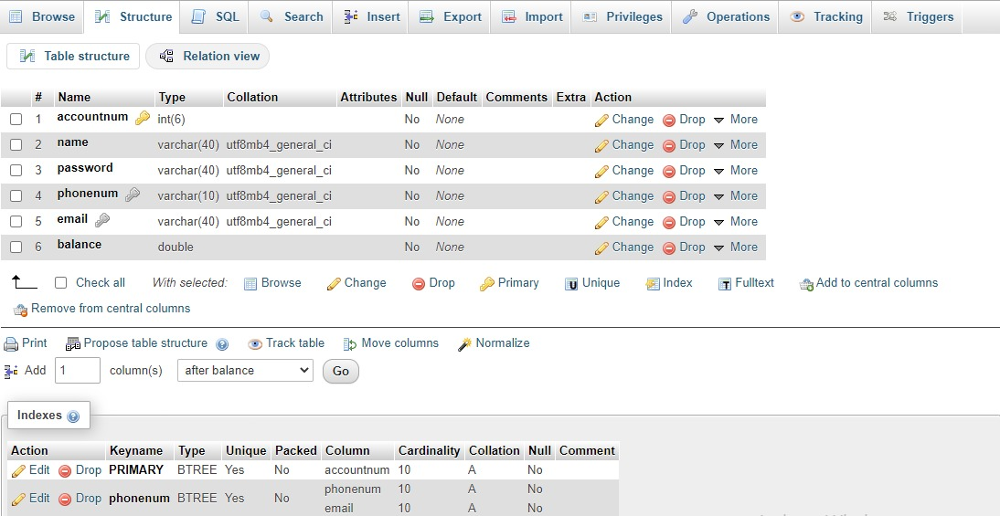

# Project Documentation
This document involoves programming naming conventions and the documentation of the project.
***
## Programming Naming Coventions
* ### Packages Naming:  
  Packages names should be written in all lower case to avoid conflict with the names of classes or interfaces.  
  ##### Example:    

    | Okay          | Not Okay    |
    | --------------| ------------|
    | `components` | `AllComponents`|    

* ### Classes Naming:
  Classes names should be nouns, in mixed case with the first letter of each internal word capitalized. Try to keep class names simple and descriptive.  
  ##### Example:  
    | Okay          | Not Okay    |
    | --------------| ------------|
    | `class BankAccount` | `class bankAccounts `|   
 
* ### Methods Naming:
  Methods should be verbs, in mixed case with the first letter lowercase, with the first letter of each internal word capitalized.  
  ##### Example:  
    | Okay          | Not Okay    |
    | --------------| ------------|
    | `getAccountNum()` | `AccountNum()`|    
    |`isNumeric()` | `checkIsNumeric()`|
* ###  Variables Naming:
  Variables, instances, and constants are in mixed case with a lowercase first letter. Internal words start with capital letters. Variable names should be short yet meaningful and not start with underscore _ or dollar sign $ characters, even though both are allowed.  
  ##### Example:  
    | Okay          | Not Okay    |
    | --------------| ------------|
    | `phoneNumber` | `num`|  
    | `custmorName` | `custName`|
* ###  Constants Naming:  
  constants should be all uppercase with words separated by underscores ("_").  
  ##### Example:  
    | Okay          | Not Okay    |
    | --------------| ------------|
    | `MIN_WIDTH ` | `minWIDTH`|  
 
* ### Other:
  Some personal conventions and shortcuts. 
  ##### Example:  
    | Example          | Shortcut   |
    | --------------| ------------|
    | `accountNumber` | `accountNum`|  
    | `getPassword()` | `getPass()`|
    | `nameJTextField` | `nameField`|
    | `passJPasswodField` | `passField`|
    | `firstPassword` | `pass1`|
    | `generateAccountNumber()` | `genAccountNum()`|
    | `minimum` | `min`|
    
***
## Formatting & Comments
  ### Format:  
  * Use defulat NetBeasns formatting by pressing : `Alt + Shift + F`.
  * Leave space beteen variables/methods and comparison/assinment symbols : `int age = 15;` , `if (age == 24)`.
  ### Comments:
  * Comments are only added to clarify any vague code.
  * Comments are added next to an unclear line of code, if the comment is too long, it can be added below that line.
  * Comments that explain the methods should be written right above the header of method.  
  * Example:
  ```
  // This method takes no arguments and print "Hello, World!"
    public void printHello(){
      String message = "Hello, World!"; // To assign the message to a variable
      System.out.println(message);
    }
  ```
***
## Design:  
<p align="center">  
       
</p>  

***    
## Running The Code :  
  The code currently is using a database that is runing on a localhost using XAMPP and phpMyadmin.
  1. Download & install the latest version of [XAMPP](https://www.apachefriends.org/download.html).
  2. Launch XAMPP and start Apache and MySQL.      
             
  3. Open a web browser and visit http://localhost/phpmyadmin.  
  4. Create a database named **bank** then a table called **accounts**.  
  5. Add 6 columns to the table and change them to be:  
           
  6. Test it by runing the code and signing up.Revisit the localhost and you should have something similar to this:  
         
  
  
  
  
